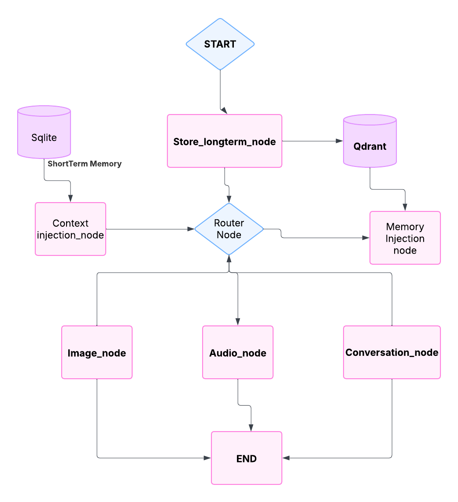

# Alice - AI Companion

Alice is an advanced AI companion that integrates with Telegram, providing a sophisticated conversational experience with multimodal capabilities including text, audio, and image generation.


## Architecture Overview

The system is built using a modular architecture with the following key components:

### Core Components

1. **Graph-Based Decision System**

   - Uses a state graph to manage conversation flow
   - Implements different nodes for various processing tasks
   - Handles conversation routing and workflow selection

2. **Memory Management**

   - Short-term memory using SQLite for active conversations
   - Long-term memory using Qdrant for persistent context
   - Memory injection for relevant context retrieval

3. **Multimodal Capabilities**
   - Text-to-Text (TTT) using llama-3.3-70b-versatile
   - Text-to-Speech (TTS) eleven_flash_v2_5
   - Text-to-Image (TTI) using SDXL
   - Speech-to-Text (STT) using Whisper

### Main Components

1. **Graph System (`src/Alice/graph/`)**

   - `graph.py`: Main graph structure and workflow
   - `nodes.py`: Individual processing nodes
   - `edges.py`: Conditional routing logic
   - `state.py`: State management

2. **Interfaces (`src/Alice/interfaces/`)**

   - FastAPI for webhook handling
   - Telegram integration
   - Chainlit for development interface

3. **Core Functionality (`src/Alice/core/`)**
   - `prompts.py`: System prompts and templates
   - `schedules.py`: Activity scheduling
   - `exceptions.py`: Error handling

## AI Agent workflow



1. **Initial Processing**

   - Message enters through the `Store_longterm_node`
   - Long-term memories are stored in Qdrant vector database
   - Short-term context is maintained in SQLite database

2. **Context and Routing**

   - `Context_injection_node` retrieves relevant context from short-term memory
   - `Router Node` determines the appropriate processing path based on message type and context
   - Routes to specialized nodes for different types of content:
     - `Image_node` for image processing
     - `Audio_node` for voice messages
     - `Conversation_node` for text messages
     - `Memory_Injection_node` for retrieving relevant memories

3. **Memory Management**

   - Short-term memory (SQLite) stores active conversation context
   - Long-term memory (Qdrant) stores persistent knowledge and experiences
   - Context injection ensures relevant information is available during processing

4. **Response Generation**

   - Each specialized node processes its content type:
     - Text responses using Groq language models
     - Audio responses using ElevenLabs TTS
     - Image generation using SDXL
   - All nodes converge to the END node for final response delivery

5. **Response Delivery**
   - Final responses are formatted and sent back through the appropriate interface
   - Supports multiple response types (text, audio, image)
   - Includes error handling and fallback mechanisms

## Configuration

The system requires several API keys and configuration settings:

- GROQ API Key
- ElevenLabs API Key and Voice ID
- Together API Key
- Qdrant API Key and URL
- Telegram Bot Token and User ID

These are configured through environment variables in the `.env` file.

## Development

1. **Setup**

   ```bash
   # Install dependencies
   pip install -r requirements.txt

   # Set up environment variables
   cp .env.example .env
   # Edit .env with your API keys
   ```

2. **Running the Server**

   - Install ngrok and run ngrok http 8000 to run your application via local machine.
   - copy the url and paste it in webhook_url varibale in controller.py as shown in the file.

   ```bash
   # Start the FastAPI server
   python src.Alice.interfaces.fastApi.controller:app --reload
   ```

3. **Setting up Webhook**
   - Access the `/set-webhook` endpoint to configure Telegram webhook
   - Ensure your server is accessible via HTTPS

## Features

- **Conversational AI**: Natural language processing and response generation
- **Multimodal Support**: Text, voice, and image interactions
- **Context Awareness**: Activity-based context injection
- **Memory Management**: Short-term and long-term memory systems
- **Conversation Summarization**: Automatic summarization of long conversations

## Error Handling

The system includes comprehensive error handling:

- Input validation
- API error handling
- Fallback mechanisms for failed responses
- Logging system for debugging

## Next Steps

- Take the application into production using AWS and github actions.
- Fine tune the models to generalize well for our use cases.
