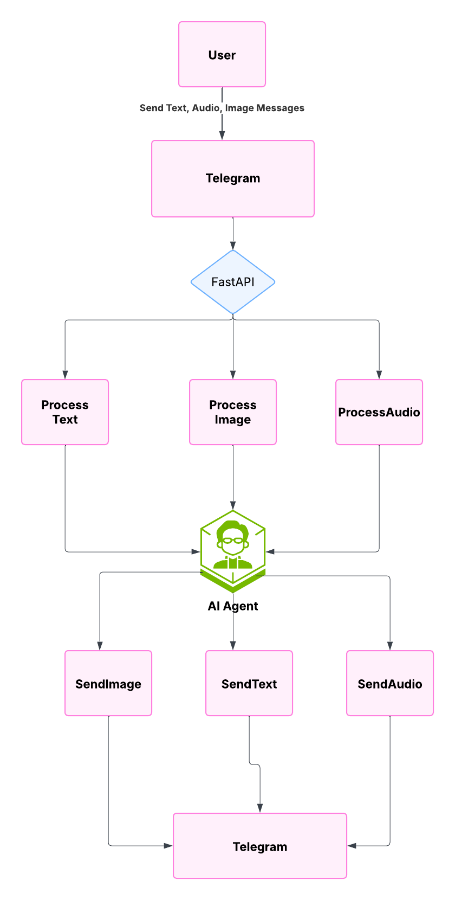

# Alice - AI Companion

Alice is an advanced AI companion that integrates with Telegram, providing a sophisticated conversational experience with multimodal capabilities including text, audio, and image generation.


## Architecture Overview

The system is built using a modular architecture with the following key components:

### Core Components

1. **Graph-Based Decision System**

   - Uses a state graph to manage conversation flow
   - Implements different nodes for various processing tasks
   - Handles conversation routing and workflow selection

2. **Memory Management**

   - Short-term memory for active conversations
   - Long-term memory for persistent context
   - Memory injection for relevant context retrieval

3. **Multimodal Capabilities**
   - Text-to-Speech (TTS) for audio responses
   - Text-to-Image (TTI) for image generation
   - Speech-to-Text (STT) for voice message processing

### Main Components

1. **Graph System (`src/Alice/graph/`)**

   - `graph.py`: Main graph structure and workflow
   - `nodes.py`: Individual processing nodes
   - `edges.py`: Conditional routing logic
   - `state.py`: State management

2. **Interfaces (`src/Alice/interfaces/`)**

   - FastAPI for webhook handling
   - Telegram integration
   - Chainlit for development interface

3. **Core Functionality (`src/Alice/core/`)**
   - `prompts.py`: System prompts and templates
   - `schedules.py`: Activity scheduling
   - `exceptions.py`: Error handling

## System Flow

1. **Message Reception**

   - Messages received through Telegram webhook
   - Supports text, voice messages, and images
   - Validates user authorization

2. **Processing Pipeline**

   - Message storage in long-term memory
   - Workflow routing based on message type
   - Context injection from current activity
   - Memory retrieval for relevant context

3. **Response Generation**

   - Text responses for conversation
   - Audio responses using TTS
   - Image generation using TTI
   - Conversation summarization when needed

4. **Response Delivery**
   - Sends responses back through Telegram
   - Handles different response types (text, audio, image)
   - Error handling and fallback mechanisms

## Configuration

The system requires several API keys and configuration settings:

- GROQ API Key
- ElevenLabs API Key and Voice ID
- Together API Key
- Qdrant API Key and URL
- Telegram Bot Token and User ID

These are configured through environment variables in the `.env` file.

## Development

1. **Setup**

   ```bash
   # Install dependencies
   pip install -r requirements.txt

   # Set up environment variables
   cp .env.example .env
   # Edit .env with your API keys
   ```

2. **Running the Server**

   ```bash
   # Start the FastAPI server
   uvicorn src.Alice.interfaces.fastApi.controller:app --reload
   ```

3. **Setting up Webhook**
   - Access the `/set-webhook` endpoint to configure Telegram webhook
   - Ensure your server is accessible via HTTPS

## Features

- **Conversational AI**: Natural language processing and response generation
- **Multimodal Support**: Text, voice, and image interactions
- **Context Awareness**: Activity-based context injection
- **Memory Management**: Short-term and long-term memory systems
- **Conversation Summarization**: Automatic summarization of long conversations

## Error Handling

The system includes comprehensive error handling:

- Input validation
- API error handling
- Fallback mechanisms for failed responses
- Logging system for debugging

## Logging

Logs are stored in the `src/logs` directory with the following information:

- Timestamp
- Log level
- Module name
- Message content
- Error details (when applicable)
